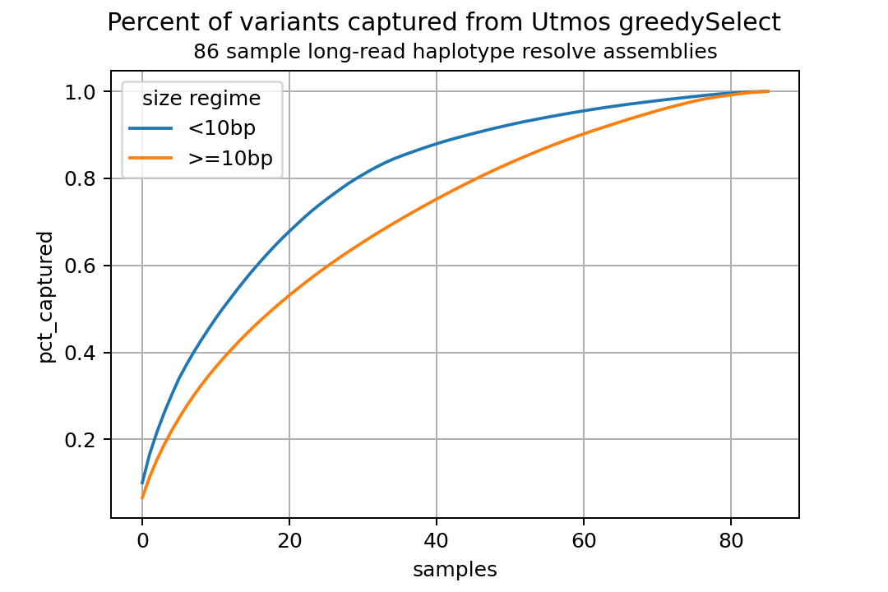

Let's investigate the diversity of variants across samples.


[Utmos](https://github.com/ACEnglish/utmos) is a program to perform a greedy approximiation of the 
maximum-coverage problem on genomic variants. We can use it to rank/sort samples by the amount of 
observed variation each contains and test if there’s more ‘diversity’ (i.e. less variant sharing) 
in smaller events (<10bp) vs larger events (>=10bp).

Commands
--------
```bash
utmos convert input.vcf.gz output.jl
utmos select -c 86 output.jl -o report.txt
```

A shortcut is to leverage utmos' "piecewise" conversion by making per-chromosome conversion jobs with
`bash mk_convert_cmds.sh`.

Results
-------


We see that the variants >=10bp taper-off more slowly than the variants under 10bp. 
The area under the curve estimate using the composite trapezodial rule to approximate integral with dx=1 is 68.0 for
<10bp and 60.6 for >=10bp.

This suggests that there may be more diversity in larger alleles than smaller alleles.

### Limitations

#### samples vs individuals
The samples were not restricted to unique individuals, therefore the replicates may slightly confound
these results. However, I believe this still serves as a reasonable estimation.

#### allele vs variant
This isn't actually measuring the allelic diverity but instead the diversity of variants. What I mean
by this is that it is possible (likely) that larger alleles are have more variablility in their 
representations than those which are smaller. For example, an expansion/contraction of a 
tandem-repeat motif could be placed in multiple positions across the tandem-repeat sequence in the 
reference whereas a SNP generally has only a single position at which it can be placed. This could 
cause a single tandem-repeat allele to be appear non-shared between samples. Therefore, at least some 
of the 'increased diversity' we're observing in the larger alleles is due to inconsistent variant 
representations.

